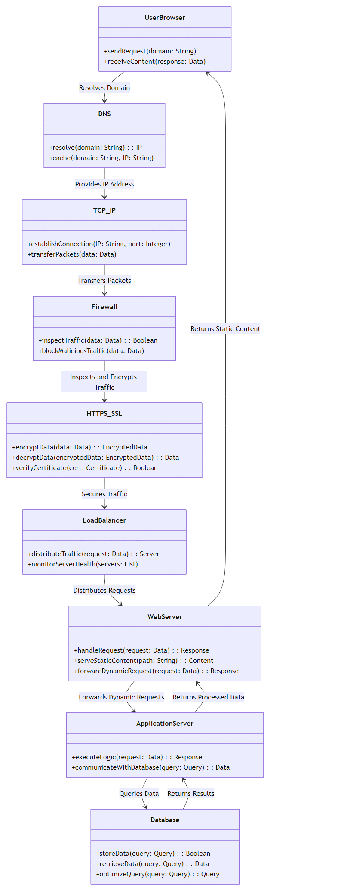
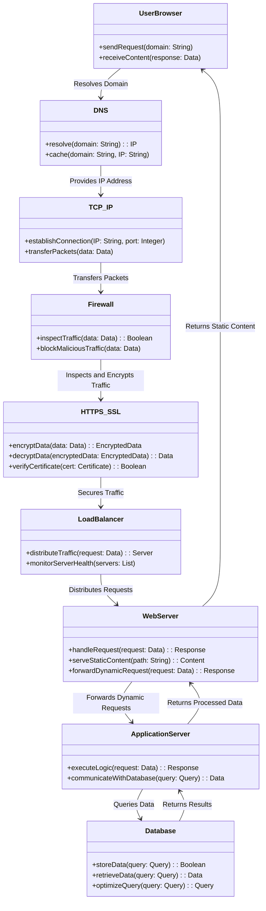

https://medium.com/@9546_58289/what-happens-when-you-type-https-www-google-com-in-your-browser-and-press-enter-6e8bd138b924

[diagram task0](diagram_task0.mmd)

```mermaid
classDiagram
    class UserBrowser {
        +sendRequest(domain: String)
        +receiveContent(response: Data)
    }

    class DNS {
        +resolve(domain: String): IP
        +cache(domain: String, IP: String)
    }

    class TCP_IP {
        +establishConnection(IP: String, port: Integer)
        +transferPackets(data: Data)
    }

    class Firewall {
        +inspectTraffic(data: Data): Boolean
        +blockMaliciousTraffic(data: Data)
    }

    class HTTPS_SSL {
        +encryptData(data: Data): EncryptedData
        +decryptData(encryptedData: EncryptedData): Data
        +verifyCertificate(cert: Certificate): Boolean
    }

    class LoadBalancer {
        +distributeTraffic(request: Data): Server
        +monitorServerHealth(servers: List<Server>)
    }

    class WebServer {
        +handleRequest(request: Data): Response
        +serveStaticContent(path: String): Content
        +forwardDynamicRequest(request: Data): Response
    }

    class ApplicationServer {
        +executeLogic(request: Data): Response
        +communicateWithDatabase(query: Query): Data
    }

    class Database {
        +storeData(query: Query): Boolean
        +retrieveData(query: Query): Data
        +optimizeQuery(query: Query): Query
    }

    %% Relationships and Interactions
    UserBrowser --> DNS : Resolves Domain
    DNS --> TCP_IP : Provides IP Address
    TCP_IP --> Firewall : Transfers Packets
    Firewall --> HTTPS_SSL : Inspects and Encrypts Traffic
    HTTPS_SSL --> LoadBalancer : Secures Traffic
    LoadBalancer --> WebServer : Distributes Requests
    WebServer --> ApplicationServer : Forwards Dynamic Requests
    WebServer --> UserBrowser : Returns Static Content
    ApplicationServer --> Database : Queries Data
    Database --> ApplicationServer : Returns Results
    ApplicationServer --> WebServer : Returns Processed Data

```
