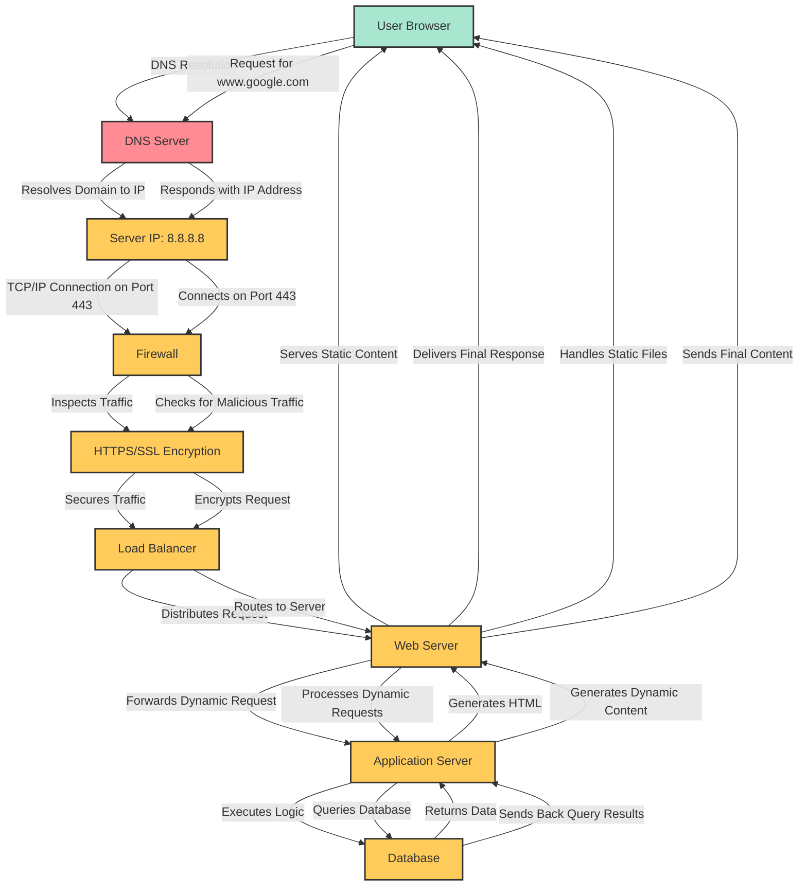

Add a schema to your blog post illustrating the flow of the request created when you type https://www.google.com in your browser and press Enter.

The diagram should show:

    DNS resolution
    that the request hitting server IP on the appropriate port
    that the traffic is encrypted
    that the traffic goes through a firewall
    that the request is distributed via a load balancer
    that the web server answers the request by serving a web page
    that the application server generates the web page
    that the application server request data from the database

[text](diagram_task1.mmd)




```plaintext
graph TD
    A[User Browser] -->|DNS Resolution| B[DNS Server]
    B -->|Resolves Domain to IP| C[Server IP: 8.8.8.8]
    C -->|TCP/IP Connection on Port 443| D[Firewall]
    D -->|Inspects Traffic| E[HTTPS/SSL Encryption]
    E -->|Secures Traffic| F[Load Balancer]
    F -->|Distributes Request| G[Web Server]

    G -->|Serves Static Content| A
    G -->|Forwards Dynamic Request| H[Application Server]
    H -->|Executes Logic| I[Database]
    I -->|Returns Data| H
    H -->|Generates HTML| G
    G -->|Delivers Final Response| A

    %% Detailed Notes
    %% DNS resolution step
    A -->|Request for www.google.com| B
    B -->|Responds with IP Address| C

    %% Connection Establishment
    C -->|Connects on Port 443| D
    D -->|Checks for Malicious Traffic| E

    %% Encryption and Load Balancing
    E -->|Encrypts Request| F
    F -->|Routes to Server| G

    %% Request Processing
    G -->|Handles Static Files| A
    G -->|Processes Dynamic Requests| H
    H -->|Queries Database| I
    I -->|Sends Back Query Results| H
    H -->|Generates Dynamic Content| G
    G -->|Sends Final Content| A

    %% Classes for Styling
    classDef client fill:#a8e6cf,stroke:#333,stroke-width:2px;
    classDef dns fill:#ff8b94,stroke:#333,stroke-width:2px;
    classDef server fill:#ffcc5c,stroke:#333,stroke-width:2px;
    classDef firewall fill:#dcedc1,stroke:#333,stroke-width:2px;
    classDef https fill:#88d8b0,stroke:#333,stroke-width:2px;
    classDef loadbalancer fill:#ffaaa5,stroke:#333,stroke-width:2px;
    classDef webserver fill:#ffd3b6,stroke:#333,stroke-width:2px;
    classDef appserver fill:#d4a5a5,stroke:#333,stroke-width:2px;
    classDef database fill:#6fc3df,stroke:#333,stroke-width:2px;

    %% Apply Classes to Nodes
    class A client;
    class B dns;
    class C,D,E,F,G,H,I server;
```
